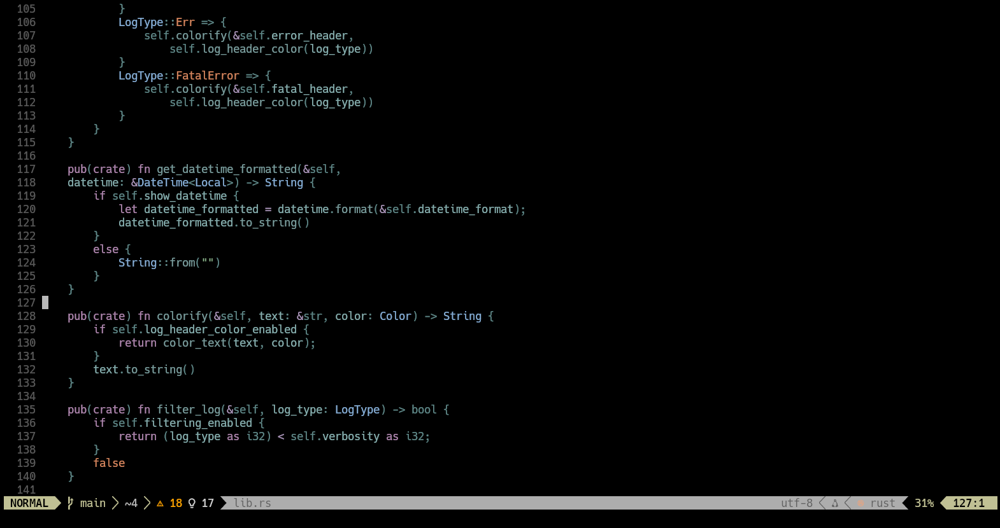
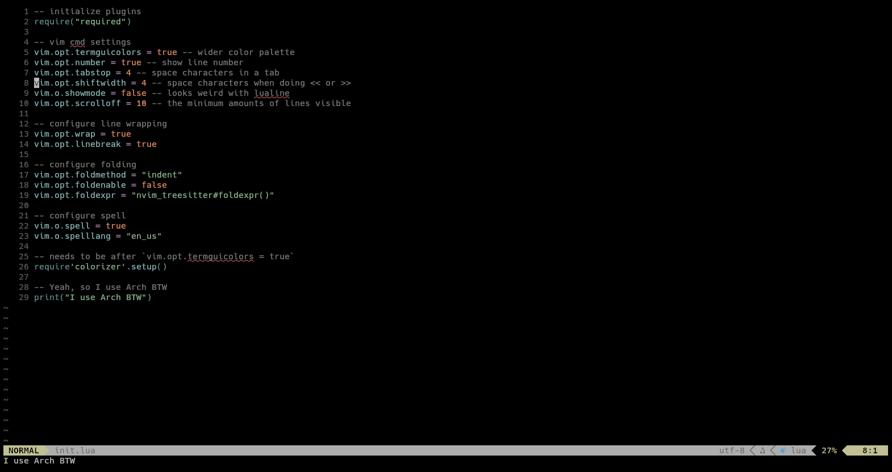

<div align="center">

# Habamax.nvim

A modified version of the vim habamax theme forked from [ntk148v/habamax.nvim](https://github.com/ntk148v/habamax.nvim).

</div>

## Screenshots




## Installation

- Using `vim-plug`:

```vim
Plug 'rktjmp/lush.nvim'
Plug 'tpaau-17DB/habamax.nvim'
```

- Using `packer`:

```lua
use { "tpaau-17DB/habamax.nvim", requires={ "rktjmp/lush.nvim" } }
```

- Using `lazy.nvim`:

```lua
{ "tpaau-17DB/habamax.nvim", dependencies={ "rktjmp/lush.nvim" } }
```

## Usage
 - vimscript:
```vim
colorscheme habamax.nvim
```

 - lua:
```lua
vim.cmd("colorscheme habamax.nvim")
```
